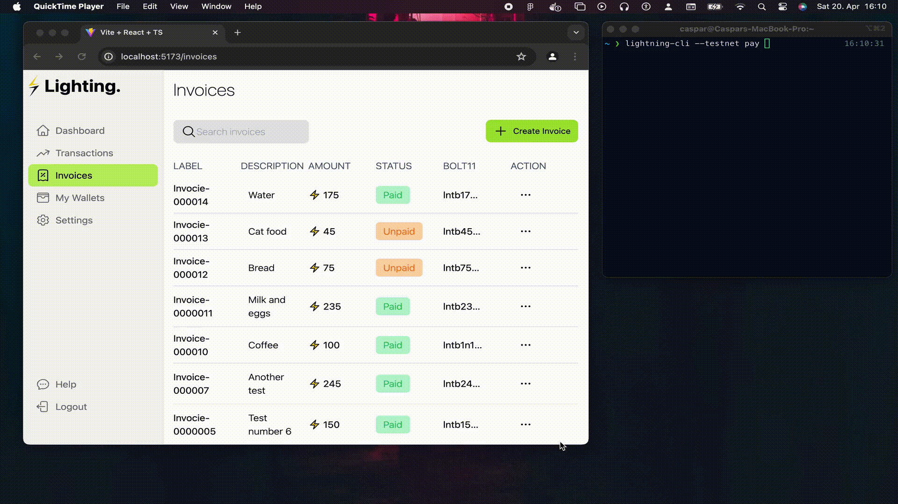

# Demo project for Lighting Network

This project is just an example that shows how one can build REST api wrapper over Core Lightning (CLN) to comminucate with lighting network.


## Setup test node
Note: desktop app doesn't work with cli.


### Install Bitcoin core (Mac OS X)

```shell
brew install bitcoin
```

#### run in testnet as a daemon (background)
```shell
bitcoind  -testnet -daemon
```

#### Check that btc node is fully syncroniszed 


```shell
bitcoin-cli -testnet getblockchaininfo
```

### Setup Lightning on Mac OS X

follow the guide https://github.com/ElementsProject/lightning/blob/master/doc/getting-started/getting-started/installation.md

Note when pyenv is installed just make sure you activate python for current shell

```shell
pyenv shell 3.8.10
```

#### Run lightning against test node

```shell
./lightningd/lightningd --network=testnet  --log-level=debug
```

### interacting with lighting

Create invoice

```shell
lightning-cli --testnet Invoice 1000 For baking 36000
```

List invoices

```shell
lightning-cli --testnet listinvoices
```

Same commands above are implemented in backend as REST api.

# Demo
[](./app-demo.gif)
